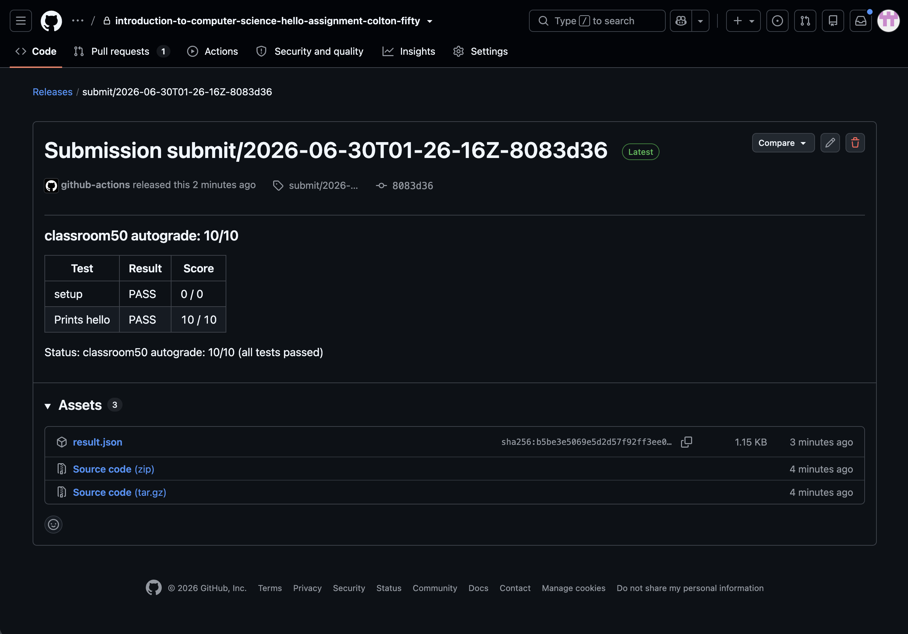

# Classroom 50 Web - Student Guide

Visit [classroom50.org](https://www.classroom50.org) to access the web interface.

# Introduction

This guide describes how to use Classroom 50 via its web interface at [classroom50.org](https://www.classroom50.org). Classroom 50 is also available as a [command-line tool](/CLI-Student-Guide.md).

This guide will cover the following topics, roughly in the order a student is likely to encounter them when managing a class with Classroom 50:

- [GitHub Setup](#github-setup)
- [Joining Your Class](#joining-your-class)
- [Logging Into Classroom 50](#logging-into-classroom-50)
- [Viewing Organizations](#viewing-organizations)
- [Accepting Assignments](#accepting-assignments)
- [Submitting Assignments](#submitting-assignments)
- [Group Assignments](#group-assignments)
- [Viewing Submissions](#viewing-submissions)

> As you use Classroom 50, if you have feature requests, discover bugs, or would like to suggest ideas for improvements, please reach out to us in our [discussion forums](https://github.com/foundation50/classroom50/discussions); we look forward to hearing from you!

# GitHub Setup

Classroom 50 is built entirely atop GitHub's existing infrastructure; as a result, in order to use Classroom 50 for your classes and assignments, [you will need a GitHub account first](https://docs.github.com/en/get-started/start-your-journey/creating-an-account-on-github). 

# Joining Your Class

Before you can view and accept assignments for your class, you will need to be invited to the [organization](https://docs.github.com/en/organizations/collaborating-with-groups-in-organizations/about-organizations) to which your class belongs. This is normally a detail your teacher or school will take care of for you; however, you will want to ensure they [send you an invitation](https://docs.github.com/en/organizations/managing-membership-in-your-organization/inviting-users-to-join-your-organization), a detail discussed in the [Teacher's Guide](Web-Teacher-Guide.md) for Classroom 50. You will then want to accept this invitation before proceeding to logging into Classroom 50 below; check the email you provided to your teacher or school that mentions inviting you to join a GitHub organization and then click the "Join" button therein!

> If you try and accept an assignment as part of the organization but have not yet accepted the organization invitation, things should still work and you should automatically join if you've been logged into Classroom 50; however, it's safest to accept the invitiation beforehand, and we will assume you have done so in these docs!

# Logging into Classroom 50

When visiting [https://classroom50.org](https://classroom50.org), you'll be prompted with a login screen.

Classroom 50 uses your GitHub credentials to establish a connection to GitHub using [OAuth 2](https://oauth.net/2/). You have two options for how to sign in:

- **Sign in with GitHub**: This is a standard OAuth flow that will use your web browser to ask GitHub for permission to perform tasks on your behalf and then redirect back to the Classroom 50 app.
- **Use a device code instead**: This is a more manual process that can act as a fallback; it requires you to copy and paste an authentication code into a page on GitHub's website that then triggers a similar OAuth permissions authorization. Once complete, Classroom 50 will poll to verify that it's been completed.

When authorizing with GitHub, ensure that any organizations you would like to use with Classroom 50 are given permission here. If you are the organization owner, you can allow access to the organization as part of the confirmation on GitHub's OAuth login screen; if you are not the organization owner, you may need to "Request" access and then have an owner grant access through the organization's OAuth settings. As a student, you will likely not have to worry about this detail, as the teacher setting up Classroom 50 will likely have already granted Classroom 50 permission when setting things up beforehand.

# Viewing Organizations

After logging in, you'll see a list of organizations you can use with Classroom 50. An organization can be in one of the following states:

- **Ready**: The organization is configured to use with Classroom 50. An "Open" button is available to access the classroom.
- **Needs service token**: The organization needs a service token to be configured by clicking "Complete Setup" for score collection to work correctly.
- **Uninitialized**: The organization shows up in the "Set Up New Classroom 50 Organization" section and can be used to begin Classroom 50 setup.

As a student, you will be mostly be concerned with organizations that are in the **Ready** state; these will show a clear "Student" label on them (as in the screenshot above), along with an "Open" button for viewing that organization. Clicking on any organization will then show you your list of assignments across the organization's classrooms to which you have access and have submitted.

> Classroom 50 organizes its data and flow around an **Organization > Classroom > Assignment** model. An **organization** might represent something like a school or university, though ultimately this is at the teacher's discretion. Within the organization, a teacher can create many **classrooms**, each of which contains a student roster and a list of **assignments**.

# Accepting Assignments

In order to better fill out your assignments page and truly get the ball rolling with Classroom 50, we'll want to try accepting an assignment. The process for this has been simplified as much as possible, but your teacher will first be required to create an assignment and then typically will send you a link to visit to do this; once you have been given this link and have both access to the organization and are added as a student to your teacher's roster for your class, you can then accept the assignment, which look like the following image.

Once you click to accept the assignment and things go well, you will be shown a success message, and a repository will be created for you within the organization that's named after your classroom, the assignment, and your username, e.g., `introduction-to-computer-science-hello-assignment-colton-fifty`.

> All of Classroom 50 is built atop GitHub and has no external server storing your or teachers' data; assignments, classrooms, and everything else are GitHub objects like repos and files that can simply be viewed on GitHub!

Once you've accepted an assignment, visiting your organization page again will show you at least one assignment/repository you now have created and have access to:

# Submitting Assignments

Because Classroom 50 is built atop GitHub, the process for assignment submission is itself as well. Therefore, the process of submission involves [committing](https://github.com/git-guides/git-commit) and [pushing](https://github.com/git-guides/git-push) changes to the repository you created when accepting your assignment. Thankfully, the Classroom 50 CLI has simplified this process for students; [see here](https://github.com/foundation50/classroom50/wiki/CLI-Student-Guide#4-submit) for further details on how to submit your assignments as a student.

# Group Assignments

Besides just creating a repository for yourself after accepting an assignment, your teacher may want students to work together in groups -- one student may act as the leader or such, accepting the assignment on behalf of several others, and those other students can be added as collaborators by the student who created the repository. Classroom 50 allows teachers to specify this setting as part of the assignment creation process, and when accepting an assignment, you will see it tagged as either "Individual" or "Group" when doing so.

To access the interface for adding collaborators, first click the edit pencil at the top-right of a group assignment, which will take you to the following page:

Then, click the "Manage collaborators" button for the assignment to be taken to the following interface, where you can then add collaborators to your project (note that they must be members of the organization and enrolled in the class for this to work):

# Viewing Submissions

On the same edit URL we were just visiting, it's also possible to view your submissions thus far; simply click the "My Submission" link in the lefthand drawer menu to see them. Assuming you've submitted at least once, you should see something like this:

Classroom 50 is set up to run autograding for assignments by default (though this can be customized by your teacher). Clicking on "View grade" will take you to a link on GitHub where you view the results for your grade, as for example in the following screenshot:

