# Classroom 50 Web - Teacher Guide

Visit [classroom50.org](https://www.classroom50.org) to access the web interface.

# Introduction

This guide describes how to use Classroom 50 via its web interface at [classroom50.org](https://www.classroom50.org). Classroom 50 is also available as a [command-line tool](/CLI-Teacher-Guide.md).

This guide will cover the following topics, roughly in the order a teacher is likely to encounter them when managing a class with Classroom 50:

- [GitHub Setup](#github-setup)
- [Logging Into Classroom 50](#logging-into-classroom-50)
- [Viewing Organizations](#viewing-organizations)
- [Setting Up Classroom 50](#setting-up-classroom-50)
- [Viewing and Creating Classrooms](#viewing-and-creating-classrooms)
- [Creating an Assignment](#creating-an-assignment)
- [Viewing and Adding Students](#viewing-and-adding-students)
- [Viewing and Collecting Submissions](#viewing-and-collecting-submissions)
- [Editing Assignments and Classrooms](#editing-assignments-and-classrooms)

> As you use Classroom 50, if you have feature requests, discover bugs, or would like to suggest ideas for improvements, please reach out to us in our [discussion forums](https://github.com/foundation50/classroom50/discussions); we look forward to hearing from you!

# GitHub Setup

Classroom 50 is built entirely atop GitHub's existing infrastructure, with no Classroom 50-owned servers storing your data. As a result, teachers can access all of their classroom data via GitHub: classrooms store data in GitHub organizations, and student rosters and submission data are stored in a specially-marked repository within your organization.

## Organizations

At the core of Classroom 50 is a [GitHub organization](https://docs.github.com/en/organizations/collaborating-with-groups-in-organizations/about-organizations) that acts as a container for everything Classroom 50 needs to function. Once you have a [GitHub account](https://docs.github.com/en/get-started/start-your-journey/creating-an-account-on-github), you will also need to create an organization that is on a Team or Enterprise plan.

### Team/Enterprise

For Classroom 50 to work properly, a [Team](https://docs.github.com/en/get-started/learning-about-github/githubs-plans#github-team) or [Enterprise](https://docs.github.com/en/get-started/learning-about-github/githubs-plans#github-enterprise) tier of organization is required. Classroom 50 uses Team plan features like GitHub Pages and branch protection to ensure that students' accounts have access to the data they need while also securing Classroom 50 against potential accidents or misuse.

> **Note that verified educators can apply to receive Team-tier organizations for free through GitHub Education**; see the information and steps [here](https://docs.github.com/en/education/about-github-education/github-education-for-teachers/apply-to-github-education-as-a-teacher) to get started if this applies to you!

Once you've created a GitHub organization on the Team plan, you're all set to begin using Classroom 50!

## Logging into Classroom 50

When visiting [https://classroom50.org](https://classroom50.org), you'll be prompted with a login screen.

Classroom 50 uses your GitHub credentials to establish a connection to GitHub using [OAuth 2](https://oauth.net/2/). You have two options for how to sign in:

- **Sign in with GitHub**: This is a standard OAuth flow that will use your web browser to ask GitHub for permission to perform tasks on your behalf and then redirect back to the Classroom 50 app.
- **Use a device code instead**: This is a more manual process that can act as a fallback; it requires you to copy and paste an authentication code into a page on GitHub's website that then triggers a similar OAuth permissions authorization. Once complete, Classroom 50 will poll to verify that it's been completed.

When authorizing with GitHub, ensure that any organizations you would like to use with Classroom 50 are given permission here. If you are the organization owner, you can allow access to the organization as part of the confirmation on GitHub's OAuth login screen; if you are not the organization owner, you may need to "Request" access and then have an owner grant access through the organization's OAuth settings.

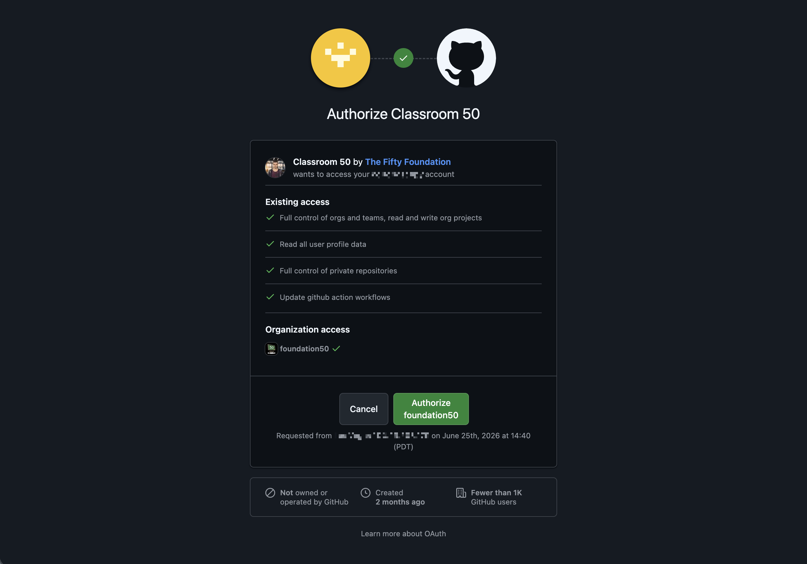

# Viewing Organizations

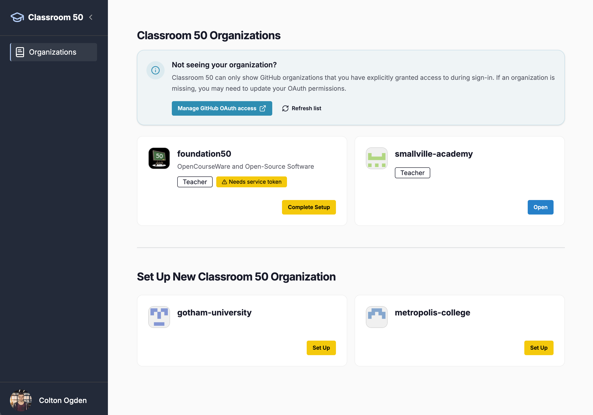

After logging in, you'll see a list of organizations you can use with Classroom 50. An organization can be in one of the following states:

- **Ready**: The organization is configured to use with Classroom 50. An "Open" button is available to access the classroom.
- **Needs service token**: The organization needs a service token to be configured by clicking "Complete Setup" for score collection to work correctly.
- **Uninitialized**: The organization shows up in the "Set Up New Classroom 50 Organization" section and can be used to begin Classroom 50 setup.

If your GitHub organization is not shown on this page, edit Classroom 50's [OAuth access privileges](https://github.com/settings/connections/applications) to grant access to the organization.

# Setting Up Classroom 50

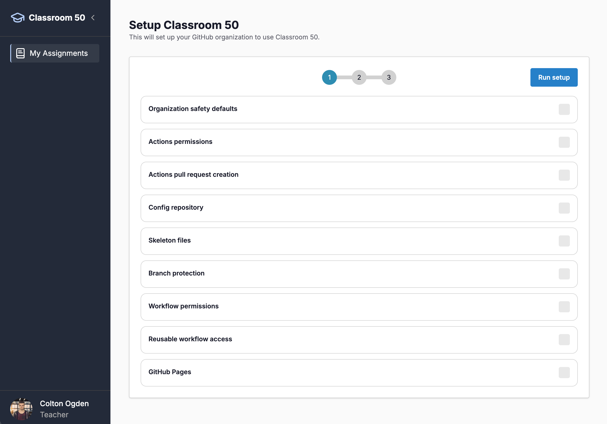

On the [organization listing](#viewing-organizations) page, click "Setup" on an uninitialized organization to see the setup process for that organization. Clicking "Run setup" will begin the automated setup process, which involves configuring organization settings and setting up a configuration repository for storing Classroom 50 state.

Once the Step 1 checklist is complete, move on to Step 2, where you can set up your `classroom50` service token.

## Personal Access Token

Classroom 50 needs a service token, a fine-grained Personal Access Token (PAT) with read access to the repositories in your classroom’s GitHub organization. It is stored as the `CLASSROOM50_SERVICE_TOKEN` secret on your `classroom50` config repo. The service token is used once daily as part of the score-collection workflow.

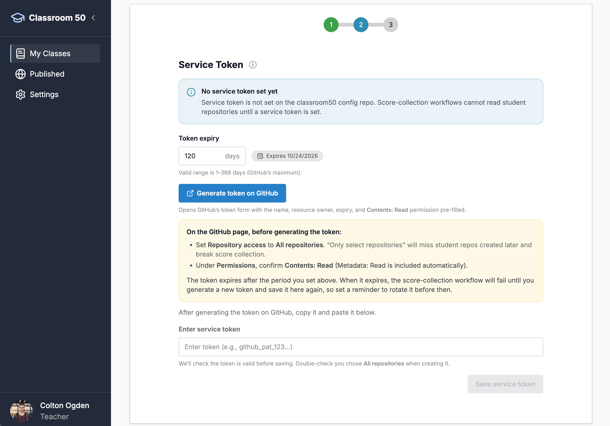

Classroom 50's interface will direct you to GitHub to obtain a PAT, at which point you can paste it into the Classroom 50 input field and submit the form to complete Classroom 50 setup.

# Viewing and Creating Classrooms

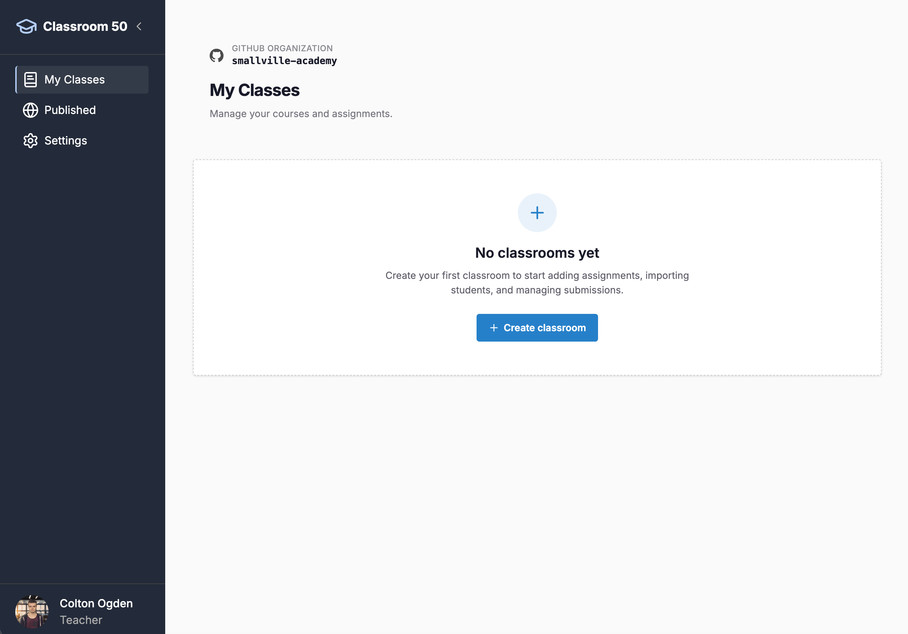

To view a configured Classroom 50 organization, click "Open" on its card on the homepage or visit a URL of the form `https://classroom50.org/<ORG>`. Once there, you will be able to view any of the classrooms you have set up within that organization.

> In Classroom 50's model, a "classroom" encapsulates a collection of students and a set of assignments for those students. Organizations may contain multiple classrooms. For example, you might create a classroom for each class period you teach for each semester.

## Creating a Classroom

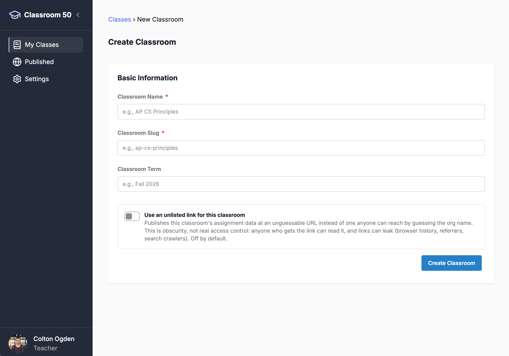

Click "Create classroom" on the "My classrooms" page to create a new classroom. Each classroom needs a **name** and a **slug** (a unique identifier for the classroom). The **term** is optional but is displayed in various places and can help differentiate between different offerings of the same course.

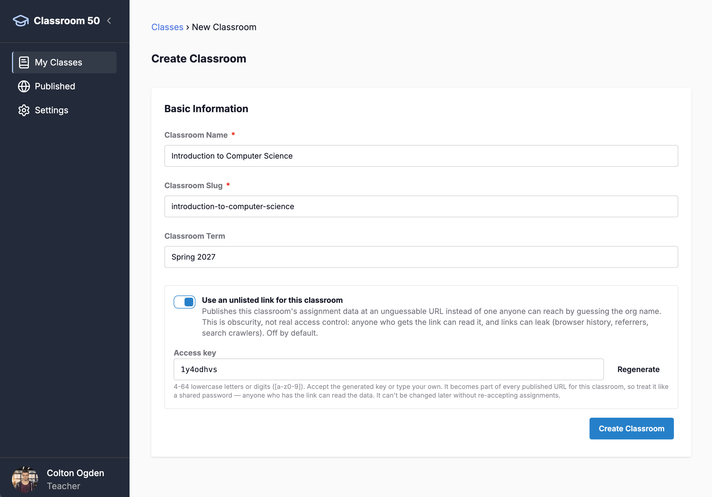

The **unlisted links** feature adds a layer of obscurity to publicly published assignment data. Classroom 50 uses GitHub Pages to make certain files, such as assignment metadata, public so that students can access them without being organization owners. By default, the classroom slug is used in the URL, which might therefore be guessable. When this feature is enabled, links will still be published publicly but after a generated hash that is harder to guess.

Once created, you'll see a message that provides you with a URL (of the form `https://classroom50.org/<ORG>/<CLASSROOM>`) that you can visit to view your newly created classroom.

> Behind the scenes, the classroom creation process creates a new subdirectory in your `classroom50` repository that holds all classroom metadata, including the student roster and assignment list.

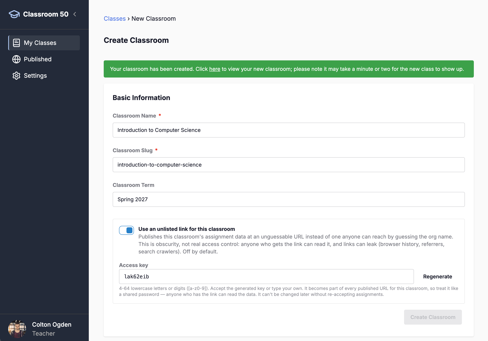

## Viewing Classrooms

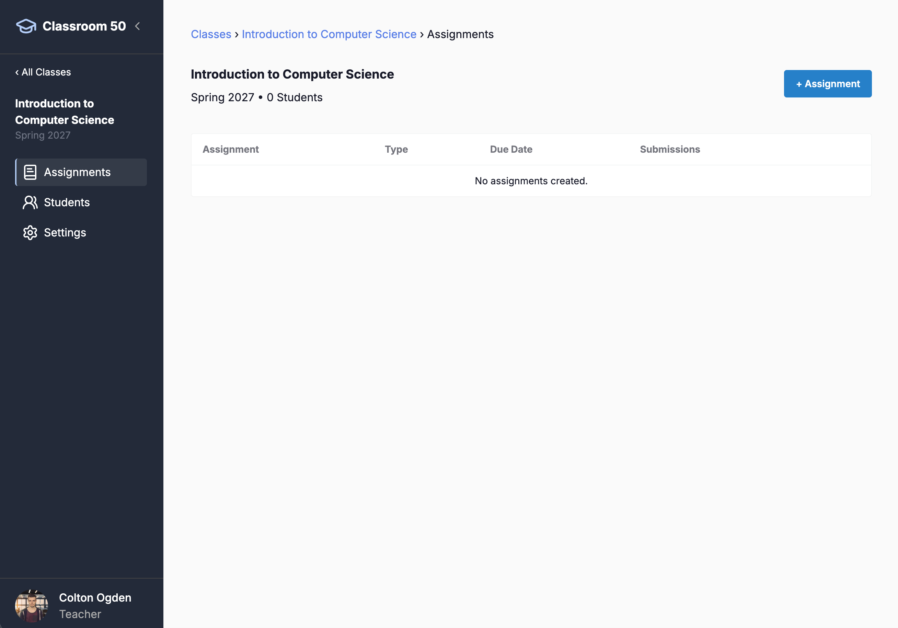

Most of a teacher's time in Classroom 50 will be spent on the classroom pages, creating and configuring assignments as well as managing students and their submissions.

## Creating an Assignment

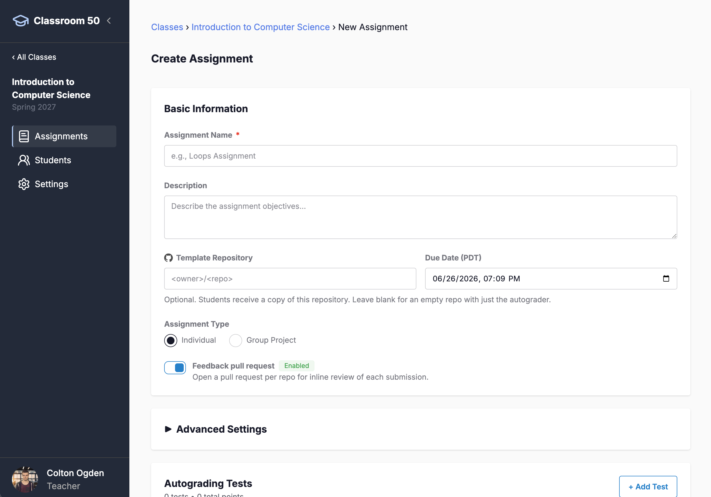

Click the "+ Assignment" button on the classroom page to create a new assignment. You'll be prompted to provide information about the assignment, including:

- **Name**: An identifier for your assignment.
- **Description**: Optional additional text describing the assignment.
- **Template Repository**: Assignments don't need a template, but you can optionally provide [a template repository](https://docs.github.com/en/repositories/creating-and-managing-repositories/creating-a-template-repository) that will be used as the starting point for students' assignment repositories. If you want your assignment to use a template, specify it here either via `<owner>/<repo>` or just `<repo>` if the template repository is located in the classroom's GitHub organization.
- **Due Date**: A specific date and time at which the assignment is due in your local timezone.
- **Assignment Type**: Students may submit either **Individual** or **Group** assignments. In individual assignments, each repository belongs to only one student; in group assignments, students can collaborate on the same repository and submit their work together.
- - **Feedback pull request**: This feature creates a pull request (PR) automatically for students when they submit, in order to provide a clean and flexible way for teachers to view a student's changes and provide feedback on their work.
- **Empty repository**: Creates each student's repository completely empty — no starter files, no autograding setup, no feedback pull request. Use this for assignments where students build everything from scratch, including their own GitHub Actions workflows (which would otherwise conflict with the autograding setup). Because the repositories carry no grading machinery, autograding, scores, and the feedback PR are disabled for the assignment, and the submissions page shows who accepted rather than grades. **This choice is permanent**: it can't be toggled after the assignment is created, since repositories students have already accepted can't be retrofitted. Enabling it hides the template, autograding-test, and grading-related fields.

### Creating an Assignment - Advanced Settings

For teachers seeking more technical customization of their autograding workflows, the assignment creation form has a section dedicated to advanced settings. These advanced settings include:

- **GitHub Runner**: [GitHub Actions](https://github.com/features/actions) autograding workflows run with [GitHub Runners](https://docs.github.com/en/actions/concepts/runners/github-hosted-runners), essentially virtual machines that act as the environment within which the workflows execute. For most use cases, `ubuntu-latest` is a reasonable default, but you can customize the runner used for your assignment here.
- **Docker Image**: This field allows specifying a custom Docker image in which autograding checks are run. Note that when using this override, the Runner **must** be an Ubuntu variant, otherwise Actions will trigger an error.
- **Setup Command**: In cases where an assignment needs some setup work before autograding can actually be processed (e.g., to compile some C code using `gcc`), specify a shell command here that runs before autograding begins.
- **Allowed files**: To prevent certain files from being included for consideration during the autograding process, this serves as a `.gitignore`-style list of files or patterns that teachers can use to include only certain files.
- **Submission release files**: Enter one exact workspace-relative file path per line. The workflow collects these files after grading and uploads them to the submission Release under their basenames. Paths are not globs, and basenames must be unique and Release-safe. Missing or unsafe files produce warnings without changing the grade or suppressing `result.json`.

Existing organizations must refresh the shared skeleton before using this field. Submission publishing does not support GitHub Immutable Releases. See [Attaching generated files to submission Releases](Autograders#attaching-generated-files-to-submission-releases) for path rules, limits, rollout, and rerun behavior.

### Creating an Assignment - Autograding Tests

Each assignment can have autograding tests associated with it. These tests run every time a student pushes to their repository. Click "+ Add Test" to configure a new test for the assignment.

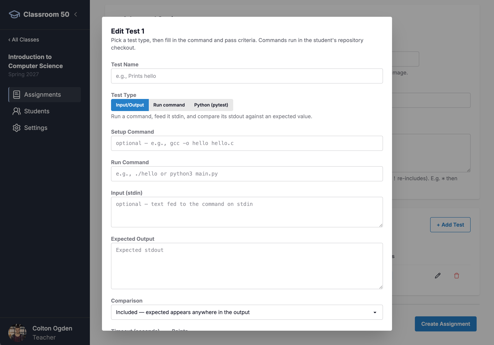

When adding a new test, you'll be prompted to specify:

- **Test Name**: A name or description for the test, used to indicate to students what passed or failed.
- **Test Type**: One of three variant types of tests with their own expected input and output shapes.
- **Setup Command**: An initial command to run within the autograder prior to the test itself executing.
- **Run Command**: The actual command the runner should invoke in order to run the test.
- **Timeout (seconds)**: How long the test should wait before terminating early in the event an expected response is not detected when running the test.
- **Points**: The number of points the test is worth, used to weight some tests as more important than others.

Additionally, each of the variants within the "Test Type" field ("Input/Output", "Run command", and "Python (pytest)") each have their own set of conditionally available fields.

#### Autograding Tests - Input/Output

This test variant is for providing input to a student's program and expecting output of a particular form.

- **Input (stdin)**: Value sent to standard input during the test execution.
- **Expected Output**: Value to check for in standard output during the test execution.
- **Comparison**: The type of comparison that should be performed to determine correctness; options are "Included" (meaning the expected result is _somewhere_ within the output), "Exact" (meaning output and the expected result are identical), and "Regex" (meaning a regular expression can be specified if seeking output that matches a particular pattern).

#### Autograding Tests - Run command

This test variant is for cases where running a command (e.g. running student's code with particular arguments) is expected to return a particular exit code.

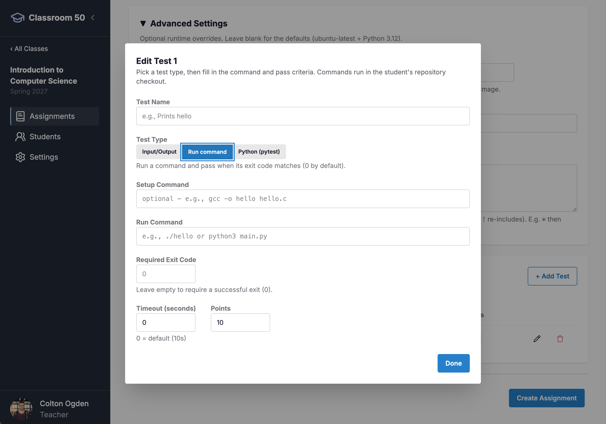

- **Required Exit Code**: The exit code that should be returned for the student to receive credit for the test.

#### Autograding Tests - Python (pytest)

This test variant does not provide any customizable fields but instead assumes a Python-based testing environment with `pytest` (a Python testing library) installed and running a set of test files with it.

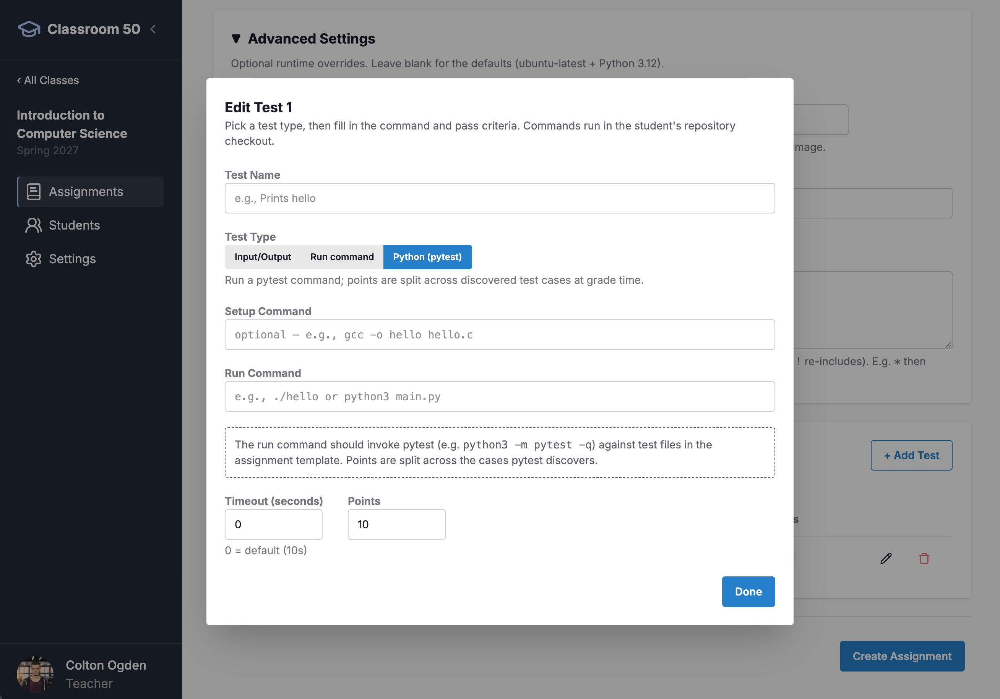

Once you are ready with your assignment definition, including any advanced settings and tests, click "Create Assignment" at the bottom of the screen to confirm creation of the assignment.

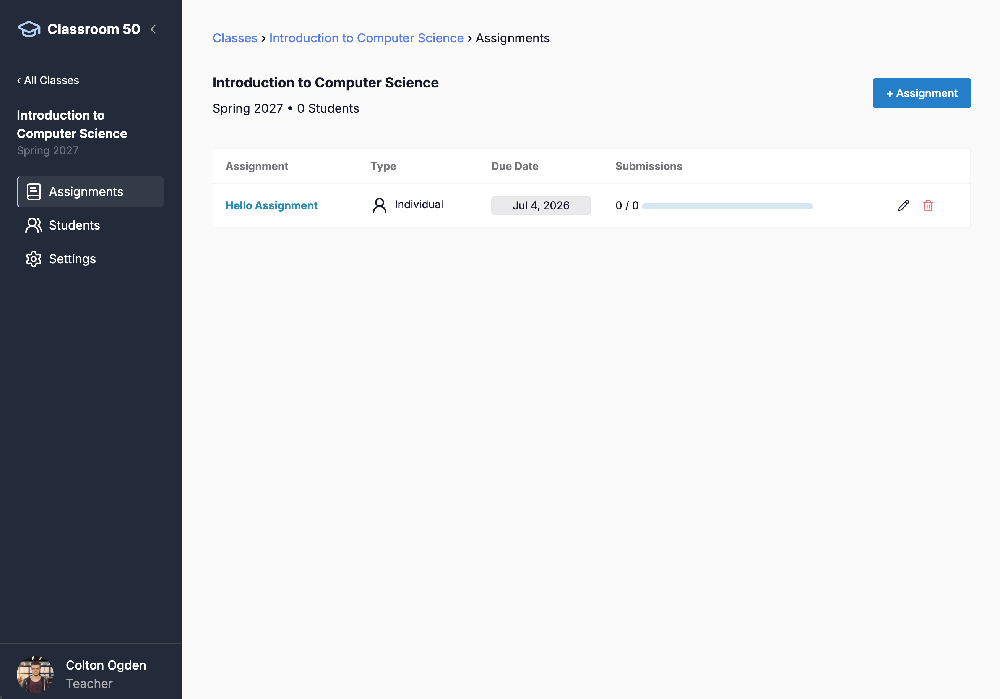

# Viewing and Adding Students

In order for students to accept an assignment, they need to be added to the classroom's roster first.

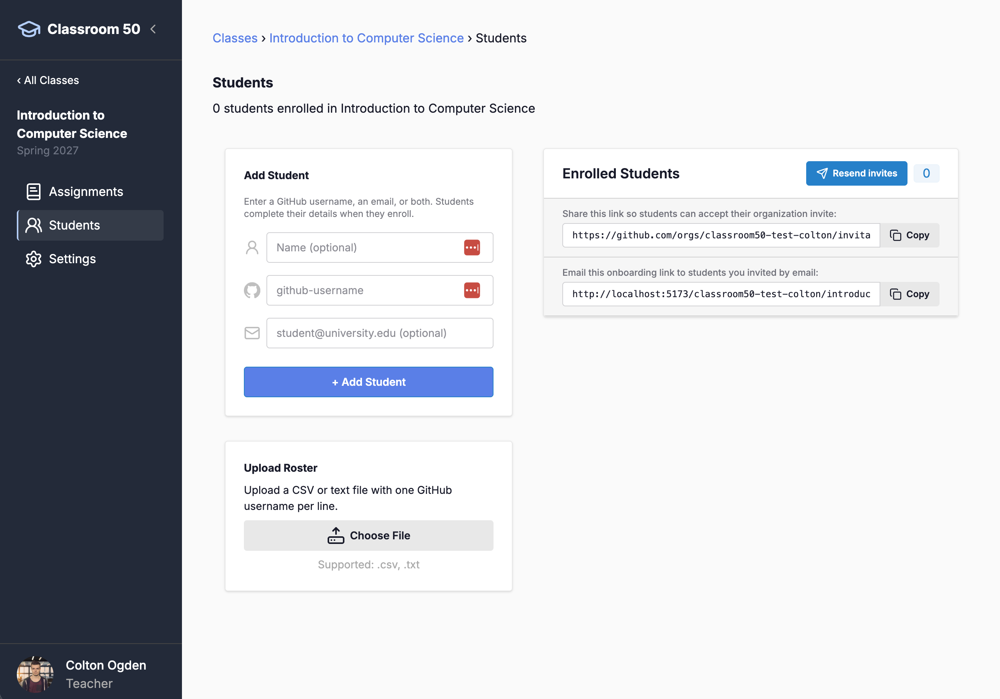

On the "Students" page within each classroom, you can add students to your classroom roster for that classroom, as well as see which students have already been added and which students still have pending invitations. When students are added to the roster, they will be sent an invitation to join your GitHub organization. Students **must accept the invitation in order to start work on assignments in the classroom**.

### Add Student

The **Add Student** panel in the top left allows for adding a student via their GitHub username; their name and email may also be optionally provided. An email can be provided in place of a GitHub username, in which case that user will have to complete a separate onboarding process (see [below](#enrolled-students) for further information).

### Upload Roster

If you already have a CSV or text file prepared with all of the GitHub usernames of your students, this provides you with a bulk option for adding many students at once.

### Enrolled Students

This is a list of all of your students already added to this classroom. As a convenience, Classroom 50 adds shareable links for teachers to provide their students: one to easily accept their organization invite, the other to onboard students in the event they've been added by email rather than by username. Below these links you can see all students in the classroom, along with their status of whether they've successfully joined the classroom's GitHub organization.

# Viewing and Collecting Submissions

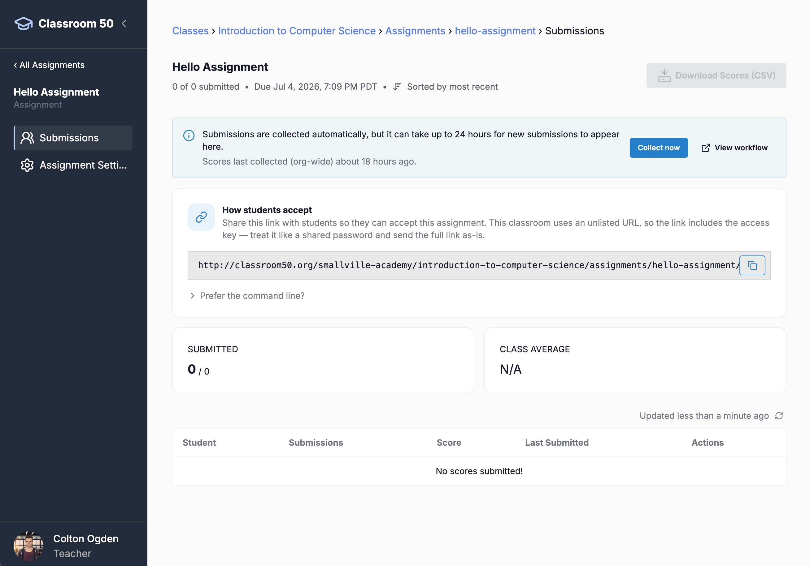

In the screenshot above, we can see that as a teacher, once you've created an assignment, you'll be able to send students a link via which they can accept the submission, at which point they will be able to then submit to it and trigger a workflow that will build a release and thereafter include any such scores as part of the score collection workflow for teachers. You need simply uncollapse the "How students accept" panel and copy the URL via its right-hand copy button, after which you can then paste to students. Should a student visit said URL, they will be taken to the following page to trigger the assignment acceptance process:

Once your student has accepted the assignment, they will be given a repo named `<CLASSROOM>-<ASSIGNMENT>-<USERNAME>` to which they can then submit their assignment through either the CLI or by committing directly. Submitting an assignment in this way will trigger an autograding workflow that ultimately produces a relase for this repository with a `result.json` file, which the score collection workflow that teachers can choose to run manually (the default for which is an automatic run daily) will aggregate into a `scores.json` file within the `classroom50/<CLASSROOM>` classroom folder.

## Viewing Submissions

Assuming you have students who have accepted the assignment, the next important puzzle piece is aggregating the submissions themselves. Scores are aggregated together rather than being done per individual student submission; teachers can choose to just allow the default nightly collection workflow to trigger, or they can trigger a manual workflow run for submission collection at any time by clicking "Collect now" at the top of the [submissions page](#viewing-and-collecting-submissions); additionally, teachers can click "View workflow" if they're interested in seeing the Actions run of the workflow in more detail. The following shows an example of what actual submissions for the assignment might look like:

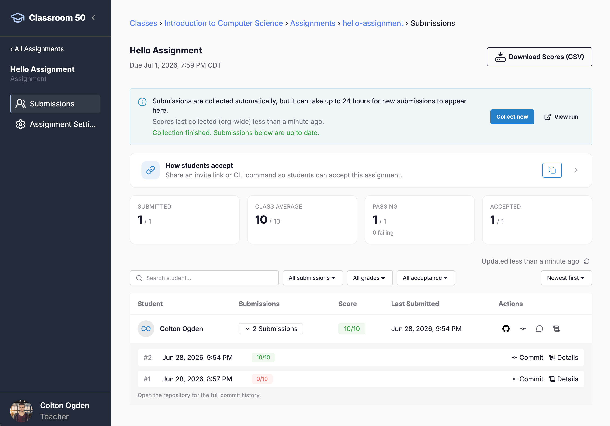

As you can see, we have a few important pieces of data we can now view:

- **Submitted**: The number of submissions / the number of students enrolled in the classroom.
- **Classroom Average**: The average grade of the students who have submitted thus far.
- **Passing**: The number of students who are passing the assignment, as well as the number who are failing.
- **Accepted**: The number of submissions that have been accepted (one per student).

> For larger classes, Classroom 50 offers some useful sorting and filtering options just below, including a search box; a series of semantic filters such as "Submitted", "On Time", and more; a filter for passing or failing grades, and a filter for "Accepted" versus "Not accepted". In addition, there are options available for sorting, such as by alphabetical order or submission date.

Each submission row itself contains not only the most recent submission for the student (or group) submitting, but also an itemized list of all submissions in total in case viewing said history is useful (by default sorted by most recent, reverse chronological order). The score is of course shown, as well as the date submitted, and buttons to view the repository itself, commit for the submission, Pull Request (or "Review"), and the release created for the submission (or "Details").

### Downloading Scores

For teachers interested in downloading all submissions as once, the top-right **Download Scores (CSV)** button allows for an easy one-click option to gather all submissions into a comma-separated list for processing in external programs or importing into Excel or Google Sheets.

# Editing Assignments and Classrooms

As shown on the lefthand drawer menu in the screenshot above, there's an option when viewing an assignment to visit "Assignment Settings"; clicking this will open the same form used when [creating an assignment](#creating-an-assignment), though with all fields pre-populated with the pre-existing data for the assignment. Similarly, one can edit classrooms themselves by clicking the "Settings" button in the lefthand drawer when viewing a classroom, which will take them to the [form for creating a classroom](#creating-a-classroom), with the data similarly pre-filled.
