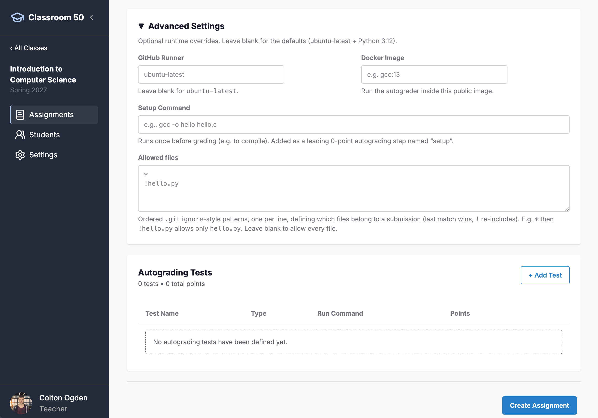

# Classroom 50 Web - Teacher Guide

**Note that this is a pre-release version of Classroom 50. Starting July 1, you may need to re-create any classrooms configured during the pre-release period.**

Visit [classroom50.org](https://www.classroom50.org) to access the web interface.

# Introduction

Welcome to the Classroom 50 Teacher's Guide for the web interface! The web interface is designed to be fully compatible with and at feature parity with the [Classroom 50 CLI](/CLI-Teacher-Guide.md). As a teacher, you will be able to view organizations for which you have access, set up organizations to be used with Classroom 50, and perform a wide range of classroom administration tasks. This guide will cover the following topics, roughly in order of what we believe a representative onboarding and usage flow may look like:

- [GitHub Setup](#github-setup)
- [Logging Into Classroom 50](#logging-into-classroom-50)
- [Viewing Organizations](#viewing-organizations)
- [Setting Up Classroom 50](#setting-up-classroom-50)
- [Viewing and Creating Classrooms](#viewing-and-creating-classrooms)
- [Viewing and Creating Assignments](#viewing-and-creating-assignments)
- [Viewing and Adding Students](#viewing-and-adding-students)
- [Viewing and Collecting Submissions](#collecting-and-viewing-submissions)
- [Editing Classroom Settings](#editing-classroom-settings)

> Throughout this documentation, we will do our best to explore all of the features that Classroom 50 has to offer; if you feel like we have missed a desired feature or see areas for improvement, please reach out to us in our [discussion forums](https://github.com/foundation50/classroom50/discussions); we look forward to hearing from you!

# GitHub Setup

Classroom 50 has been built entirely atop GitHub's existing infrastructure, as opposed to a dedicated private server. You as a teacher get to own all of your own data: classrooms are in GitHub repos within organizations you control, student rosters are CSV files in a specially-marked repo within your organization, and both assignments and their submissions are stored as blocks of JSON in designated files. With this openness of the platform, however, comes a minor upfront cost, namely that certain prerequisite elements have to be set up on GitHub properly in advance so that Classroom 50 can find all of the pieces of data it needs to function.

## Organizations

At the core of Classroom 50 is the [GitHub Organzation](https://docs.github.com/en/organizations/collaborating-with-groups-in-organizations/about-organizations). An organization, in GitHub's own words, "serves as a container for your shared work", and thus allows us to collect all of the things we need to make Classroom 50 function and put them in a central place. Therefore, you will not only need to create a [GitHub account](https://docs.github.com/en/get-started/start-your-journey/creating-an-account-on-github), but you will also need to create an organization that is on a Team or Enterprise plan.

### Team/Enterprise

For Classroom 50 to work properly, a [Team](https://docs.github.com/en/get-started/learning-about-github/githubs-plans#github-team) or [Enterprise](https://docs.github.com/en/get-started/learning-about-github/githubs-plans#github-enterprise) tier of organization will be required. While Free-tier organizations do exist, they disallow certain mechanisms that would hinder Classroom 50 as a solution. In particular, **Free-tier organizations cannot publish publicly to GitHub Pages from a private repo.** The purpose for why this is necessary will be made clearer later, but for now it suffices to know that it would make accepting assignments on students' end impossible unless other highly-sensitive Classroom 50 metadata were made public, which is non-negotiable for most if not all teachers. Besides that, there are a couple of other features, like branch protection, that are also only available on Team or Enterprise and which help secure Classroom 50 against potential accidents or misuse.

> **Note that verified educators can apply to receive a Team-tier organization for free through GitHub Education**; see the information and steps [here](https://docs.github.com/en/education/about-github-education/github-education-for-teachers/apply-to-github-education-as-a-teacher) to get started if this applies to you!

Once you've created a GitHub organization, you will have all you technically need to get started with Classroom 50!

## Logging into Classroom 50

The very first thing you will see when visiting [https://classroom50.org](https://classroom50.org) is a login screen, where it is assumed at this point that you have a GitHub account (see [Organizations](#organizations) for more on that). Classroom 50, as we noted previously, does not have its own dedicated server, and so we build atop your existing GitHub credentials to establish a connection to GitHub using [OAuth 2](https://oauth.net/2/). The two options on the login screen are two different available ways for storing a similar authentication token that Classroom 50 will use on your behalf to make authenticated requests to GitHub's servers to take care of various things, such as generating repos from templates, triggering workflows for score collection, and much more. These two options are:

- **Sign in with GitHub**: This is a standard OAuth flow that will leverage your web browser to ask GitHub for permission to perform tasks on your behalf and then redirect back to the Classroom 50 app.
- **Use a device code instead**: This is a more manual process that can act as a fallback; it requires you to copy and paste an authentication code into a special URL on GitHub's end that then triggers a similar OAuth permissions authorization; once complete, Classroom 50 will poll to verify that it's been completed.

Classroom 50 functions identically once logged in, whether you choose "Sign in with GitHub" or "Use a device code instead".

> It's very important to ensure that any organizations you would like Classroom 50 to access are given permission here; if you are the organization owner, this will be straightforward, as you must simply make sure the organization is allowed access as part of the confirmation on GitHub's OAuth page during login; if you are not the organization owner, you may need to "Request" access and then have an owner grant said access through the organization's OAuth settings.

# Viewing Organizations

On logging in, you will first be taken to a view of the organizations you are a member of. As shown in the screenshot above, there are multiple states an organization can be in related to Classroom 50, split between Classroom 50 organizations and those that are accessible but uninitialized:

- **Ready**: `smallville-academy`, shown above, is in the "Ready" state, meaning that Classroom 50 has been fully set up and can be used to create classrooms, assignments, and more.
- **Needs service token**: `foundation50`, shown in the screenshot, has been set up through most of the needed steps, but it still requires a service token to be set in order to allow for score collection (more on this later). Some features will be technically allowed, but it is best to fully complete setup before continuing.
- **Uninitialized**: These organizations, shown in the "Set Up New Classroom 50 Organization" section, are accessible to the authenticated user but have not gone through any of the Classroom 50 setup process.

As shown in the note at the top of the page, it is possible after login to edit one's [OAuth access priviliges](https://github.com/settings/connections/applications) to grant access to organizations, should they be granted access after login or in the event they missed granting access during login. It is also possible to log out and back in again by clicking on one's avatar at the bottom left and clicking "Sign Out", which will redirect back to the login page.

# Setting Up Classroom 50

On the [org listing](#viewing-organizations) page, clicking "Setup" on an uninitialized organization will take you to the setup page for that organization, the URL for which will look like `https://classroom50.org/<ORG>/setup`. The Classroom 50 setup process is a largely automated process that, assuming your organization has been set up on either Team or Enterprise and you have admin access, should be quite smooth. Here's a step-by-step breakdown of what each step in the setup process does at a high level:

- **Organization safety defaults**: This sets up your organization such that default repository permissions are set to `none`, in addition to disallowing the creation of public repositories. This ensures for example that students cannot by default see other students' repositories, ensuring overall a tigher level of security and privacy than GitHub's defaults.
- **Actions permissions**: Key to Classroom 50's overall functioning as a course management platform, in particular its autograding integration, is the ability for it to run Actions workflows that automate this process. This step enables the use of Actions within the organization.
- **Actions pull request creation**: To allow teachers to view their students' work in a diff style leveraging GitHub's platform, they will need to create Pull Requests (PRs), and this step allows Actions to do this.
- **Config repository**: At the heart of Classroom 50's functioning is a private repository only admins can access, aptly named `classroom50`. This repository stores all config information for the organization to function using Classroom 50's integration, including but not limited to assignment definitions, student rosters, subdirectories for individual classrooms, and more. This step creates the `classroom50` repository.
- **Skeleton files**: Besides the repository for `classroom50` itself, certain initial files for bootstrapping a fresh organization must be added to the repository, namely workflow YAML files that tie into Actions and autograding.
- **Branch protection**: To ensure things like force pushing and other scenarios cannot occur, Classroom 50 enforces branch protection, which is also a feature available only to Team or Enterprise users.
- **Workflow permissions**: This step ensures that workflows have permission to write files while simultaneously ensuring they cannot approve PRs, acting as a hardening layer to preserve teacher authority while allowing autograding workflows when triggered by students to still be robust.
- **Reusable workflow access**: To allow workflows to use other pre-created workflows, this is a special permission that must be set within the organization.
- **GitHub Pages**: An important part of allowing for submission acceptance on the students' side is via exposing certain files in `classroom50`, ordinarily a private repo, via public GitHub Pages endpoints; this step toggles GitHub Pages for said repository to allow this.

Once you have clicked "Run setup" and allowed Classroom 50 to finish going through the process checklist, Step 1 will show as completed, at which point you can move on to Step 2, where you can set up your `classroom50` service token.

## Personal Access Token

Classroom 50 needs a service token, a fine-grained Personal Access Token (PAT) with read access to the repositories in your classroom’s GitHub organization. It is stored as the `CLASSROOM50_SERVICE_TOKEN` secret on your `classroom50` config repo, where the nightly score-collection workflow uses it to read student submissions.

As shown in the screenshot, the GUI will direct users to GitHub to obtain their PAT, at which point you can simply paste it into the input field and then submit it, at which point you will have then completed Classroom 50 setup (assuming no errors otherwise!).

# Viewing and Creating Classrooms

Once you have initialized your organization of choice with Classroom 50 and wish to view said organization, click "Open" on its card on the home page or visit a URL of the form `https://classroom50.org/<ORG>`. Once there, you will be able to view any of the classrooms you have set up within that organization.

> In Classroom 50's model, a "classroom" is really meant to encapsulate its equivalent in the real world: a collection of students which form a roster, as well as a set of assignments with associated scores generated via student submissions. Other tools, such as autograding, embellish the process of using Classroom 50 as a student and teacher, but the core really revolves around managing students and assignments. Organizations may contain multiple classrooms, much like an educational institution might do, though classrooms (or "classes", if we wish to think of them in this way) can operate much within the mold of class terms as well, where one may have, for example, "Introduction to Computer Science", the same "class", as a different classroom for each separate term; i.e., Introduction to Computer Science for the term of Spring 2027, Spring 2028, and so on, all kept separate from one another, but all contained within the same organization.

After first having set up an organization, of course, there won't *be* any classrooms, but this is easily corrected by us proceeding to create a classroom via clicking, as shown in the screenshot above, the "+ Create classroom" button.

## Creating a Classroom

Creating a classroom is itself a fairly straightforward process. The **name** itself is straightforward; the **slug**, however, is important insofar as it will map ultimately to a directory path in your `classroom50` repo once created and will thus need to be **unique per classroom**. The **term** is optional but is displayed in various places and can help act as a visual differentiator for the same class in different iterations.

The **unlisted links** feature toggle is to add a layer of obscurity to publicly published assignment data; Classroom 50 uses GitHub Pages to make certain files, such as assignment data per classroom, public such that students can access them without being organization owners. However, given a classroom slug, it becomes easy to guess these URLs, should someone know about the organization; by toggling this feature, however, links will still be published publicly but after a generated hash (e.g., `https://smallville-academy@github.io/introduction-to-computer-science/assignments.json` may become `https://smallville-academy@github.io/j84b98a0/assignments.json` instead).

Once created, a success alert will display, giving you easy access to a URL (of the form `https://classroom50.org/<ORG>/<CLASSROOM>`) that you can click to view your newly created classroom. Alongside this, you can verify for yourself in the `classroom50` repo within your organization that there is now a new subdirectory with an identical name to your classroom slug, within which all classroom metadata will now exist, such as assignments (`assignments.json`), students (`students.csv`), and more!

## Viewing Classrooms

Most of a Teacher's time in Classroom 50 will be spent here, administering classrooms via the creation and viewing of assignments, as well as managing students and their submissions (all of which can be navigated to via the lefthand drawer menu). On fresh classroom creation, there are no assignments; once again, we need only click the readily available button as shown in the above screenshot that will take us to creating our first assignment, "+ Assignment"!

## Creating an Assignment

Creating an assignment entails a bit more than when creating a classroom. The name is of course important, as this will effectively determine the slug that gets created identifying that assignment when it gets saved to our classroom's `assignments.json` file. Now's a good time to make that point clear: every assignment is simply a block of JSON with its own slug (one of its key-value pairs), and Classroom 50 is simply giving you a user-friendly way to make changes to it within the web browser. But you could certainly choose to make changes to it manually and commit them if you wish! As stated before, all of the data is owned by you, existing on GitHub's infrastructure -- no hidden or private servers obscuring your data!

An overview of each field in the creation form for assignments is as follows:

- **Name**: An identifier for your assignment that will be compressed into a URL-friendly slug. This slug will be used to create a uniquely identifying key for the JSON block that will live in `classroom50/<CLASSROOM>/assignments.json`.
- **Description**: An optional bit of text for storing descriptive data about the assignment.
- **Template Repository**: Assignments don't need a template to exist, but if as a teacher you would like to give students starter code or just anything as a starting point for their assignment, you will need to [create a template repository](https://docs.github.com/en/repositories/creating-and-managing-repositories/creating-a-template-repository) and then provide the repo path for it here, either via `<owner>/<repo>` or just `<repo>`. Students will start their own assignment repositories with the code included in said template project.
- **Due Date**: A specific time at which the assignment is due, based on the timezone from which the teacher is creating the assignment.
- **Assignment Type**: Students may submit either **Individual** or **Group** assignments; individual assignments are rather straightforward in that one student submits one project, whereas group assignments allow for students to permit collaborators to join their repository, whereby the group submits together.- **Feedback pull request**: This feature toggle creates a Pull Request (PR) automatically for students when they submit, in order to provide a clean and flexible view for teachers to view the changes between a student's submission and the starting template of the repository, whether or not there is one.

### Creating an Assignment - Advanced Settings

For those teachers seeking more technical customization of their autograding workflows in particular, the assignment creation form has a section dedicated to advanced settings for such (collapsed by default). A rundown of the various fields therein is as follows:

- **GitHub Runner**: All [GitHub Actions](https://github.com/features/actions) workflows run in so-called [GitHub Runners](https://docs.github.com/en/actions/concepts/runners/github-hosted-runners), essentially virtual machines that act as the environment within which the workflows do the actual work. For many, `ubuntu-latest` will serve as a reasonable default, but folks seeking to use a specific runner beyond that may override such here.
- **Docker Image**: For folks seeking to run their workflows within a dedicated Docker image as well, this field allows said specification. Note that when using this override, the Runner **must** be an Ubuntu variant, else Actions will trigger an error.
- **Setup Command**: In the event an assignment needs some setup work before autograding can actually be processed (e.g., to compile some C code using `gcc`), this serves as a terminal command field.
- **Allowed files**: Should we wish to prevent certain files from being included for consideration during the autograding process, this serves as a `.gitignore`-style list of files or patterns that teachers can use to whitelist or blacklist certain files.

### Creating an Assignment - Autograding Tests

As can be seen in the prior screenshot, below the "Advanced Settings" pane is another pane dedicated to defining the actual tests that comprise the autograding workflow for this assignment. By default, there are no tests, but a teacher need simply click "+ Add Test" in order to bring up a modal to define their first and subsequent tests.

> All tests are stored alongside the assignment itself as the `tests` key within `assignments.json` and as such are completely editable outside the GUI.

A breakdown of the fields available for definition in said form are as follows:

- **Test Name**: A text string identifying the test for use e.g., in identifying visually and in autograding workflows.
- **Test Type**: One of three variant types of tests with their own expected input and output shapes.
- **Setup Command**: An initial command to run within the Actions runner prior to the test itself executing.
- **Run Command**: The actual command the runner should invoke in order to run the test.
- **Timeout (seconds)**: How long the test should wait before terminating early in the event an expected response does not emit when running the test.
- **Points**: The number of points the test will be worth should it pass.

Additionally, each of the variants within the "Test Type" field ("Input/Output", "Run command", and "Python (pytest)") each have their own set of conditionally available fields.

#### Autograding Tests - Input/Output

This test variant is for testing customizable input and/or output when running the test.

- **Input (stdin)**: Value sent to standard input during the test execution.
- **Expected Output**: Valid send to standard output during the test execution.
- **Comparison**: The type of comparison that should be performed to determine correctness; options are "Included" (meaning the expected result is *somewhere* within the output), "Exact" (meaning output and the expected result are identical), and "Regex" (meaning a regular expression can be specified if seeking an output pattern more so than a specific result).

#### Autograding Tests - Run command

This variant is for cases where input and output per se don't matter but rather that the command returns an expected exit code at the shell.

- **Required Exit Code**: The exit code expected to produce a correct result for the test at the shell when the test runs.

#### Autograding Tests - Python (pytest)

This view does not provide any customizable fields but instead assumes a Python-based testing environment with `pytest` (a Python testing library) installed and running a set of test files with it.

Once you are ready with your assignment definition, including any advanced settings and tests, simply click "Create Assignment" at the bottom of the screen, where you will be redirected back to your classroom's page, where you can then see your assignment ready to collect submissions.

That said, an assignment by itself isn't enough; we also need students! To that end, let's transition to viewing the students in our classroom, which we can visit by clicking "Students" in the drawer on the lefthand side while viewing our classroom.

# Viewing and Adding Students

On the "Students" page within each classroom, you can add students to your class roster for that classroom, as well as see which students have already been added and which students are pending invitations. All students added here are stored in your `classroom50/<CLASSROOM/` repo folder in `students.csv`. In order to properly function as students within your classroom, students **must be invited to and accept said invitation to your GitHub organization**. We have tried to simplify this process through this interface.

### Add Student

The **Add Student** panel, top left, allows for adding a student via their GitHub username; their name and email may also be optionally provided, in which case that data will be stored alongside the GitHub username (as well as the user's dynamically fetched GitHub user ID) within the `students.csv` file. An email can be provided in place of a GitHub username, in which case that user will have to complete a separate onboarding process (see [below](#enrolled-students) for further information).

### Upload Roster

If you already have a CSV or text file prepared with all of the GitHub usernames of your students, this provides you with a bulk option for adding many students at once.

### Enrolled Students

This is a list of all of your students already added to this classroom. As a convenience, Classroom 50 adds shareable links for teachers to provide their students, one to easily accept their organization invite, the other to onboard students in the event they've been added by email rather than by username. Below these links you can then see all added students sequentially, as well as the status of whether they've successfully joined the GitHub organization itself.

# Viewing and Collecting Submissions

In the screenshot above, we can see that as a teacher, once you've created an assignment, you'll be able to send students a link via which they can accept the submission, at which point they will be able to then submit to it and trigger a workflow that will build a release and thereafter include any such scores as part of the score collection workflow for teachers. You need simply uncollapse the "How students accept" panel and copy the URL via its right-hand copy button, after which you can then paste to students. Should a student visit said URL, they will be taken to the following page to trigger the assignment acceptance process:

Once your student has accepted the assignment, they will be given a repo named `<CLASSROOM>-<ASSIGNMENT>-<USERNAME>` to which they can then submit their assignment through either the CLI or by committing directly. Submitting an assignment in this way will trigger an autograding workflow that ultimately produces a relase for this repository with a `result.json` file, which the score collection workflow that teachers can choose to run manually (the default for which is an automatic run daily) will aggregate into a `scores.json` file within the `classroom50/<CLASSROOM>` classroom folder.

## Viewing Submissions

Assuming you have students who have accepted the assignment, the next important puzzle piece is aggregating the submissions themselves. Scores are aggregated together rather than being done per individual student submission; teachers can choose to just allow the default nightly collection workflow to trigger, or they can trigger a manual workflow run for submission collection at any time by clicking "Collect now" at the top of the [submissions page](#viewing-and-collecting-submissions); additionally, teachers can click "View workflow" if they're interested in seeing the Actions run of the workflow in more detail. The following shows an example of what actual submissions for the assignment might look like:

As you can see, we have a few important pieces of data we can now view:

- **Submitted**: The number of submissions / the number of students enrolled in the course.
- **Class Average**: The average grade of the students who have submitted thus far.
- **Passing**: The number of students who are passing the assignment, as well as the number who are failing.
- **Accepted**: The number of submissions that have been accepted (one per student).

> For larger classes, Classroom 50 offers some useful sorting and filtering options just below, including a search box; a series of semantic filters such as "Submitted", "On Time", and more; a filter for passing or failing grades, and a filter for "Accepted" versus "Not accepted". In addition, there are options available for sorting, such as by alphabetical order or submission date.

Each submission row itself contains not only the most recent submission for the student (or group) submitting, but also an itemized list of all submissions in total in case viewing said history is useful (by default sorted by most recent, reverse chronological order). The score is of course shown, as well as the date submitted, and buttons to view the repository itself, commit for the submission, Pull Request (or "Review"), and the release created for the submission (or "Details").

# Editing Assignments and Classrooms

As shown on the lefthand drawer menu in the screenshot above, there's an option when viewing an assignment to visit "Assignment Settings"; clicking this will open the same form used when [creating an assignment](#creating-an-assignment), though with all fields pre-populated with the pre-existing data for the assignment. Similarly, one can edit classrooms themselves by clicking the "Settings" button in the lefthand drawer when viewing a classroom, which will take them to the [form for creating a classroom](#creating-a-classroom), with the data similarly pre-filled.
